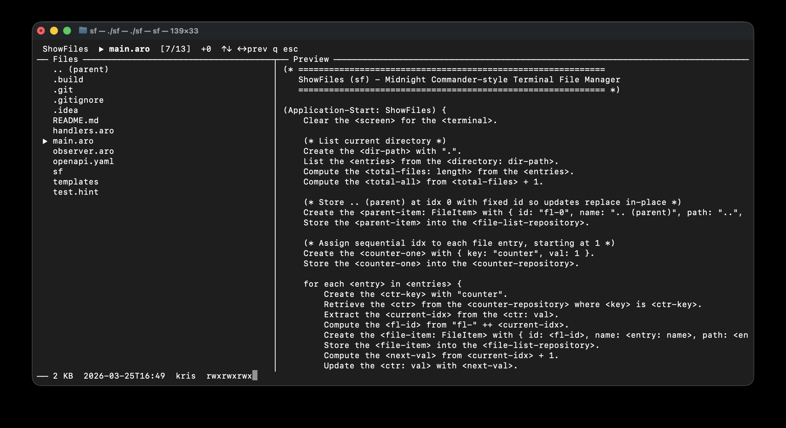

# ShowFiles (sf)

A Midnight Commander-style terminal file manager written in [ARO](https://arolang.github.io/aro/).



## Features

- Dual-panel layout: file list on the left, file preview on the right
- Navigate with arrow keys (up/down to select, Enter to open directories)
- Scrollable file list and preview panel
- Streams only the first bytes of files for fast previews

## Installation

**macOS (Homebrew)**
```bash
brew tap arolang/applications
brew install arolang/applications/sf
```

**Linux / macOS (Manual)**

Download the latest release from the [Releases](https://github.com/arolang/ShowFiles/releases) page, extract, and move to your PATH:
```bash
sudo mv sf /usr/local/bin/
```

## Building from Source

Requires the ARO toolchain (`aro` CLI). Install it via `brew tap arolang/aro && brew install aro` or from [GitHub releases](https://github.com/arolang/aro/releases).

```bash
# Syntax check
aro check .

# Run directly (interpreter mode)
aro run .

# Compile to native binary
aro build . --optimize
```

The compiled binary is placed in `.build/`.

## Project Structure

```
sf/
├── main.aro              # Application startup and initial state
├── handlers.aro          # Keyboard input handlers
├── observer.aro          # Repository observers (reactive UI rendering)
├── openapi.yaml          # Schema definitions for UIState and FileItem
└── templates/
    └── display.screen    # Terminal screen template
```
